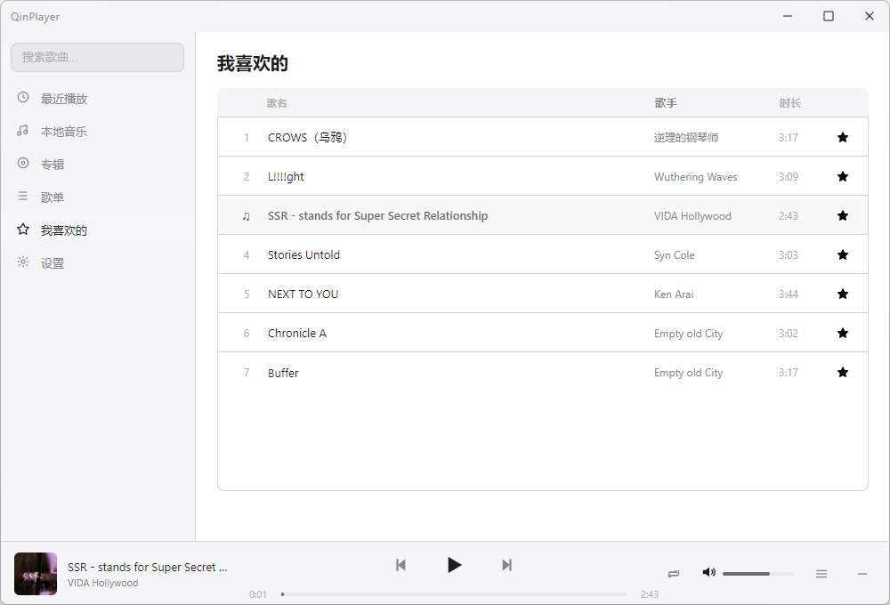
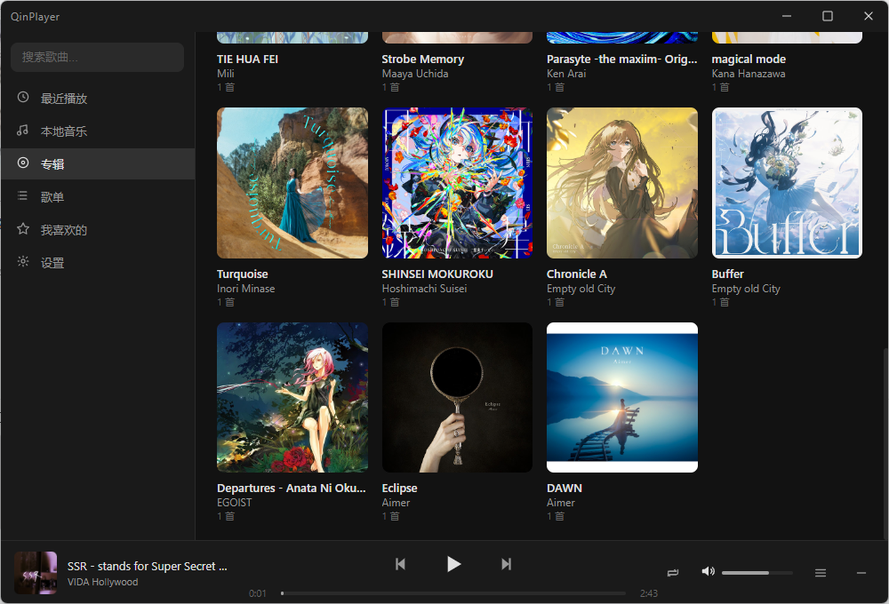

# QinPlayer

> 纯本地音乐播放器 — 不联网，不打扰，只属于你的音乐空间。

</p>

---

## 功能一览

### 播放
- 播放 / 暂停 / 上一首 / 下一首 / 进度条 / 音量
- 三种播放模式：顺序播放、单曲循环、随机播放
- 切歌淡入淡出（Web Audio API GainNode 实现，毫秒级平滑过渡）
- 音频输出设备切换
- Media Session API 接管 Windows 任务栏媒体控制 + 键盘多媒体按键

### 歌词
- 自动读取同目录同名 `.lrc` 文件
- 逐行滚动，当前行高亮，GPU 硬件加速
- 歌词界面：左侧大封面 + 歌曲信息，右侧歌词滚动
- 背景色从封面主色自动提取
- 歌词时间轴偏移设置（±0.5s），兼容不准的 LRC 文件

### 歌单
- 手动创建歌单，支持增删改重命名
- 歌曲排序：按添加顺序 / 按播放次数，升序 / 降序
- 右键菜单：播放、添加到歌单、从歌单移除、打开文件所在目录、查看歌曲信息

### 专辑
- 网格视图展示所有专辑（封面 + 专辑名 + 歌手）
- 点击专辑进入歌曲列表

### 其他
- 最近播放（记录 50 首）
- 我喜欢的（五角星标记）
- 按歌名、歌手搜索
- 迷你模式（300×80 控制条）
- 系统托盘（最小化到托盘继续播放）
- 亮色 / 暗色 / 跟随系统主题切换
- 导入 / 导出数据备份

---

## 截图

<p align="center">
  
  <br><em>我喜欢的 · 亮色主题</em>
</p>

<p align="center">
  
  <br><em>专辑网格 · 暗色主题</em>
</p>

---

## 技术栈

| 层 | 技术 |
|----|------|
| 框架 | Electron + electron-vite |
| 前端 | React + TypeScript + Zustand |
| 数据库 | SQLite（better-sqlite3） |
| 音频引擎 | Web Audio API |
| 后台扫描 | Node.js Worker Threads |
| 打包 | electron-builder |

---

## 技术亮点

### 自定义协议加载本地资源
注册 `qinplayer://` 自定义协议，主进程拦截请求后直接流式响应本地音频文件，绕过浏览器 CORS 限制，原生支持 Range Requests（拖动进度条无需等待）。

### Worker Threads 后台扫描
使用 Node.js `worker_threads` 在独立线程中扫描文件夹并解析 ID3 标签，不阻塞 UI 渲染。支持增量扫描——仅解析新增或修改的文件，秒级启动。

### 歌词滚动 GPU 加速
歌词容器使用 CSS `transform: translateY()` + `will-change: transform` 实现硬件加速滚动，60fps 流畅无掉帧。

### 状态驱动架构
Zustand 管理全局状态，`useAudioSync` 负责状态到音频引擎的单向同步。进度条状态不进全局 Store，用 `useRef` 直接更新 DOM，避免不必要的 re-render。

---

## 安装

前往 [Releases](https://github.com/qiuyuehu/QinPlayer/releases) 下载最新安装包。

运行安装程序，按提示完成安装即可。首次启动后，点击设置 → 添加音乐文件夹路径即可导入歌曲。

---

## 从源码构建

```bash
# 克隆仓库
git clone https://github.com/qiuyuehu/QinPlayer.git
cd QinPlayer

# 安装依赖
npm install

# 重新编译 native 模块（better-sqlite3 需要）
npx electron-rebuild

# 开发模式运行
npm run dev

# 打包安装程序
npm run build
```

---

## 项目结构

```
QinPlayer/
├── src/
│   ├── main/          # Electron 主进程
│   ├── preload/       # 预加载脚本
│   └── renderer/      # React 渲染进程
│       ├── components/  # UI 组件
│       ├── stores/      # Zustand 状态管理
│       ├── hooks/       # 自定义 Hooks
│       └── styles/      # 全局样式
├── assets/            # 图标、托盘图标等资源
├── build/             # 构建配置
└── docs/              # 文档
```

---

## 已知限制

- 纯本地播放器，不支持在线流媒体
- 不支持均衡器
- 不支持导入 `.m3u` 歌单文件
- 仅 Windows 平台

---

## 作者

秋月 + 衾衾 (Hermes Agent)

---

## 许可证

MIT License
